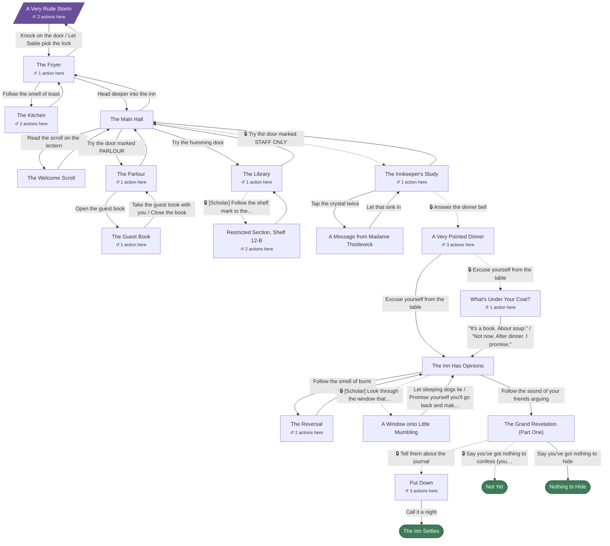

# Story map

> **Generated automatically from the story files. Don't edit this page by hand:** it is
> rebuilt whenever story changes are merged into `main`. To change the story, edit the
> files in `content/stories/` (see `docs/editing-guide.md`).

## The Invisible Inn

21 scenes · 4 items · 7 quests · roles: Scholar, Rogue (coming soon), Mage (coming soon)

**How to read the diagram:** the slanted box is where the story starts, and rounded green boxes are endings. **Dotted arrows with 🔒** need something first (an item, flag or quest); solid arrows don't, though some disappear after they've been used once. "[Scholar]" marks a choice for one role. "↺ N actions here" counts choices that stay in the same scene. Arrow labels are shortened; the tables below have the full text and every condition.

## Scenes in detail

### A Very Rude Storm

`arrival_storm` in `scenes/01_arrival.yaml` · **start**

| Choice | Leads to | Needs | Does |
|---|---|---|---|
| Knock on the door | The Foyer (`foyer_arrival`) | — | — |
| [Scholar] Study the shimmering doorframe | *(stays here)* | Scholar only; not flag `noticed_wards` (disappears once that changes) | sets `noticed_wards` |
| Let Sable pick the lock | The Foyer (`foyer_arrival`) | — | — |
| Suggest you all keep walking | *(stays here)* | not flag `tried_leaving` (disappears once that changes) | sets `tried_leaving` |

### The Foyer

`foyer_arrival` in `scenes/01_arrival.yaml`

| Choice | Leads to | Needs | Does |
|---|---|---|---|
| Warm up by the fire | *(stays here)* | not flag `warmed_up` (disappears once that changes) | sets `warmed_up` |
| Follow the smell of toast | The Kitchen (`kitchen`) | — | — |
| Head deeper into the inn | The Main Hall (`main_hall`) | — | — |
| Step back outside into the storm | A Very Rude Storm (`arrival_storm`) | — | — |

### The Kitchen

`kitchen` in `scenes/01_arrival.yaml`

| Choice | Leads to | Needs | Does |
|---|---|---|---|
| Say something nice to the kettle | *(stays here)* | not flag `kettle_cheered` (disappears once that changes) | sets `kettle_cheered`; 📜 starts *Cure the Kettle* |
| Eat the toast | *(stays here)* | not flag `ate_toast` (disappears once that changes) | sets `ate_toast` |
| Back to the foyer | The Foyer (`foyer_arrival`) | — | — |

### The Main Hall

`main_hall` in `scenes/02_main_hall.yaml` · own text for: Scholar

| Choice | Leads to | Needs | Does |
|---|---|---|---|
| Read the scroll on the lectern | The Welcome Scroll (`welcome_scroll`) | doesn't have Welcome Scroll (disappears once that changes) | ➕ Welcome Scroll |
| Try the door marked PARLOUR | The Parlour (`guest_book_parlor`) | — | — |
| Try the humming door | The Library (`library_chaos`) | — | — |
| Try the door marked STAFF ONLY | The Innkeeper's Study (`innkeeper_study`) | quest *The Inn's Chaotic History* done (greyed out until then) | 📜 starts *The Empty Front Desk* |
| Back to the foyer | The Foyer (`foyer_arrival`) | — | — |

### The Welcome Scroll

`welcome_scroll` in `scenes/02_main_hall.yaml`

| Choice | Leads to | Needs | Does |
|---|---|---|---|
| Roll it up and keep it | The Main Hall (`main_hall`) | — | — |

### The Parlour

`guest_book_parlor` in `scenes/03_parlor.yaml`

| Choice | Leads to | Needs | Does |
|---|---|---|---|
| Open the guest book | The Guest Book (`guest_book_entries`) | — | 📜 starts *The Inn's Chaotic History* |
| Ask Sable what she's looking for | *(stays here)* | not flag `asked_sable` (disappears once that changes) | sets `asked_sable`; 📜 starts *Clear the Air* |
| Back to the main hall | The Main Hall (`main_hall`) | — | — |

### The Guest Book

`guest_book_entries` in `scenes/03_parlor.yaml`

| Choice | Leads to | Needs | Does |
|---|---|---|---|
| [Scholar] Look closer at the entry in your handwriting | *(stays here)* | Scholar only; not flag `saw_own_entry` (disappears once that changes) | sets `saw_own_entry` |
| Take the guest book with you | The Parlour (`guest_book_parlor`) | doesn't have Guest Book (disappears once that changes) | ➕ Guest Book; ✅ completes *The Inn's Chaotic History* |
| Close the book | The Parlour (`guest_book_parlor`) | — | — |

### The Library

`library_chaos` in `scenes/04_library.yaml` · own text for: Scholar

| Choice | Leads to | Needs | Does |
|---|---|---|---|
| [Scholar] Follow the shelf mark to the Restricted section | Restricted Section, Shelf 12-B (`scholar_archive`) | Scholar only; flag `saw_own_entry`; not flag `visited_archive` (greyed out until then) | sets `visited_archive`; 📜 starts *What Is Memory, Really?* |
| Pull Fennick away from his shelf | *(stays here)* | not flag `pulled_fennick` (disappears once that changes) | sets `pulled_fennick` |
| Back to the main hall | The Main Hall (`main_hall`) | — | — |

### Restricted Section, Shelf 12-B

`scholar_archive` in `scenes/04_library.yaml`

| Choice | Leads to | Needs | Does |
|---|---|---|---|
| Take the journal | *(stays here)* | doesn't have Journal in Your Handwriting (disappears once that changes) | ➕ Journal in Your Handwriting; 📜 starts *The Forbidden Research* |
| Pocket the vial of memory ink | *(stays here)* | doesn't have Vial of Memory Ink (disappears once that changes) | ➕ Vial of Memory Ink; 📜 starts *Memory Is A Fickle Thing* |
| Back to the library | The Library (`library_chaos`) | has Journal in Your Handwriting (hidden until then) | — |
| Put everything back and walk away. Briskly. | The Library (`library_chaos`) | doesn't have Journal in Your Handwriting (disappears once that changes) | — |

### The Innkeeper's Study

`innkeeper_study` in `scenes/05_study.yaml`

| Choice | Leads to | Needs | Does |
|---|---|---|---|
| Read the sticky notes | *(stays here)* | not flag `read_notes` (disappears once that changes) | sets `read_notes` |
| Tap the crystal twice | A Message from Madame Thistlewick (`crystal_message`) | quest *The Empty Front Desk* not done (disappears once that changes) | — |
| Answer the dinner bell | A Very Pointed Dinner (`dining_room`) | quest *The Empty Front Desk* done (greyed out until then) | — |
| Back to the main hall | The Main Hall (`main_hall`) | — | — |

### A Message from Madame Thistlewick

`crystal_message` in `scenes/05_study.yaml`

| Choice | Leads to | Needs | Does |
|---|---|---|---|
| Let that sink in | The Innkeeper's Study (`innkeeper_study`) | — | ✅ completes *The Empty Front Desk* |

### A Very Pointed Dinner

`dining_room` in `scenes/06_dinner.yaml`

| Choice | Leads to | Needs | Does |
|---|---|---|---|
| [Scholar] Read the letters in your soup | *(stays here)* | Scholar only; not flag `read_soup` (disappears once that changes) | sets `read_soup` |
| Ask Sable why her bread roll clinks | *(stays here)* | not flag `asked_about_roll` (disappears once that changes) | sets `asked_about_roll` |
| Ask Fennick why he won't drink his tea | *(stays here)* | not flag `asked_about_tea` (disappears once that changes) | sets `asked_about_tea` |
| Excuse yourself from the table | What's Under Your Coat? (`dinner_caught`) | has Journal in Your Handwriting (hidden until then) | — |
| Excuse yourself from the table | The Inn Has Opinions (`inn_responds`) | doesn't have Journal in Your Handwriting (disappears once that changes) | — |

### What's Under Your Coat?

`dinner_caught` in `scenes/06_dinner.yaml`

| Choice | Leads to | Needs | Does |
|---|---|---|---|
| "It's a book. About soup." | The Inn Has Opinions (`inn_responds`) | — | sets `told_a_lie` |
| "Not now. After dinner. I promise." | The Inn Has Opinions (`inn_responds`) | — | sets `promised_later` |
| [Scholar] Dab a drop of memory ink on Sable's napkin | *(stays here)* | Scholar only; has Vial of Memory Ink; not flag `inked_the_napkin` (hidden until then) | sets `inked_the_napkin` |

### The Inn Has Opinions

`inn_responds` in `scenes/06_dinner.yaml`

| Choice | Leads to | Needs | Does |
|---|---|---|---|
| Follow the smell of burnt toast | The Reversal (`kitchen_attempt`) | — | — |
| [Scholar] Look through the window that wasn't there before | A Window onto Little Mumbling (`mumbling_window`) | Scholar only; quest *What Is Memory, Really?* in progress (hidden until then) | — |
| Follow the sound of your friends arguing | The Grand Revelation (Part One) (`grand_revelation`) | — | — |

### The Reversal

`kitchen_attempt` in `scenes/06_dinner.yaml`

| Choice | Leads to | Needs | Does |
|---|---|---|---|
| [Scholar] Check Fennick's equations | *(stays here)* | Scholar only; not flag `checked_equations` (disappears once that changes) | sets `checked_equations` |
| [Mage] Try the reversal spell yourself | *(stays here)* | Mage only; not flag `checked_equations` (disappears once that changes) | sets `checked_equations` |
| Leave Fennick to it | The Inn Has Opinions (`inn_responds`) | — | — |

### A Window onto Little Mumbling

`mumbling_window` in `scenes/06_dinner.yaml`

| Choice | Leads to | Needs | Does |
|---|---|---|---|
| Let sleeping dogs lie | The Inn Has Opinions (`inn_responds`) | — | sets `let_it_lie`; ✅ completes *What Is Memory, Really?* |
| Promise yourself you'll go back and make it right | The Inn Has Opinions (`inn_responds`) | — | sets `make_it_right`; ✅ completes *What Is Memory, Really?* |

### The Grand Revelation (Part One)

`grand_revelation` in `scenes/07_revelation.yaml`

| Choice | Leads to | Needs | Does |
|---|---|---|---|
| Tell them about the journal | Put Down (`confession_aftermath`) | has Journal in Your Handwriting (hidden until then) | sets `scholar_truth_accepted`; ✅ completes *The Forbidden Research*; ✅ completes *Clear the Air* |
| Say you've got nothing to confess (you do) | Not Yet (`ending_secret`) | has Journal in Your Handwriting (hidden until then) | ✅ completes *Clear the Air* |
| Say you've got nothing to hide | Nothing to Hide (`ending_unaware`) | doesn't have Journal in Your Handwriting (disappears once that changes) | ✅ completes *Clear the Air* |

### Put Down

`confession_aftermath` in `scenes/07_revelation.yaml`

| Choice | Leads to | Needs | Does |
|---|---|---|---|
| Help Fennick with the kettle, all three of you | *(stays here)* | quest *Cure the Kettle* not done (disappears once that changes) | ✅ completes *Cure the Kettle* |
| [Scholar] Pour the memory ink into the fire | *(stays here)* | Scholar only; has Vial of Memory Ink (hidden until then) | ➖ Vial of Memory Ink; sets `destroyed_ink`; ✅ completes *Memory Is A Fickle Thing* |
| [Scholar] Keep the vial. Just in case. | *(stays here)* | Scholar only; has Vial of Memory Ink; not flag `kept_ink` (hidden until then) | sets `kept_ink` |
| Call it a night | The Inn Settles (`ending_confess`) | — | — |

### The Inn Settles

`ending_confess` in `scenes/07_revelation.yaml` · **ending**

### Not Yet

`ending_secret` in `scenes/07_revelation.yaml` · **ending**

### Nothing to Hide

`ending_unaware` in `scenes/07_revelation.yaml` · **ending**

